# MuLiMa Pro — Music Library Manager Pro & DJ Set Studio

<div align="center">
  <h3>Professionelle KI-unterstützte Musik-Bibliothek, Harmonic Mixing & DJ Set Zeitleiste</h3>
  <p>Entwickelt für DJs, Producer und Musik-Kuratoren zur nahtlosen Vorbereitung von Live-Sets mit echten Techno-Mixing-Techniken.</p>
</div>

---

## ⚡ Schnellstart auf einem anderen PC

Du möchtest **MuLiMa Pro** auf einem anderen PC (z. B. Windows-Laptop, MacBook oder Linux-Workstation) installieren und starten? Das geht in wenigen Schritten:

### 🖥️ Option 1: 1-Klick Start (Windows)
1. Klone oder lade das Repository auf deinen PC herunter:
   ```bash
   git clone https://github.com/h4real82/music-library-manager-pro.git
   ```
2. Mache einen **Doppelklick auf `start.bat`**:
   - Das Skript prüft automatisch Node.js.
   - Installiert beim ersten Start alle benötigten Pakete (`npm install`).
   - Erstellt den Musik-Ordner `LIBRARY\`.
   - Öffnet deinen Browser automatisch auf `http://localhost:3000` und startet den Server.

---

### 💻 Option 2: Manuelle Installation (Windows, macOS, Linux)

#### Voraussetzungen
- [Node.js](https://nodejs.org/) (Version 18 oder höher) **oder** [Bun](https://bun.sh/)
- Ein moderner Webbrowser (Chrome, Edge, Brave, Firefox, Safari)

#### Schritte
```bash
# 1. Repository klonen
git clone https://github.com/h4real82/music-library-manager-pro.git
cd music-library-manager-pro

# 2. Abhängigkeiten installieren
npm install
# oder mit Bun:
# bun install

# 3. Entwicklungs-Server starten
npm run dev
# oder mit Bun:
# bun run dev
```
Öffne anschließend [http://localhost:3000](http://localhost:3000) im Browser.

---

### 🎵 Musikdateien hinzufügen
Es gibt zwei einfache Wege, um deine Musiksammlung in die App zu laden:

1. **Lokaler Ordner `LIBRARY/` (Empfohlen für Desktop-Betrieb)**:
   - Kopiere deine MP3-, WAV-, FLAC-, AAC- oder OGG-Dateien direkt in den Ordner `LIBRARY/` im Projektverzeichnis (Unterordner werden automatisch rekursiv durchsucht).
   - Die App liest Metadaten, BPM, Tonarten und Albumbilder direkt ein.
2. **Web-Import im Browser (HTML5 File API)**:
   - Klicke in der App oben links auf **"Library Manager"** oder den Import-Button.
   - Wähle **"Dateien importieren"** oder **"Ganzen Ordner importieren"**, oder ziehe Audio-Dateien per **Drag & Drop** in das Browser-Fenster.

---

## 🌐 Direkt im Browser betreiben über GitHub Pages

**MuLiMa Pro kann vollständig serverlos als moderne Web-App über GitHub Pages betrieben werden!**

Da die Audio-Engine, Wellenform-Generierung, Takt-Analyse und Set-Verwaltung auf **HTML5 Web Audio API** und **IndexedDB** basieren, läuft die App nach dem Deployment direkt im Browser:

### So aktivierst du GitHub Pages für dein Repository:

#### Option A: Automatisch über GitHub Actions
1. Gehe in deinem GitHub-Repository auf den Tab **Actions** ➔ **New workflow** ➔ **set up a workflow yourself**.
2. Nenne die Datei `deploy.yml` und füge folgenden Inhalt ein:
   ```yaml
   name: Deploy to GitHub Pages
   on:
     push:
       branches: [main]
   permissions:
     contents: read
     pages: write
     id-token: write
   concurrency:
     group: 'pages'
     cancel-in-progress: true
   jobs:
     build-and-deploy:
       environment:
         name: github-pages
         url: ${{ steps.deployment.outputs.page_url }}
       runs-on: ubuntu-latest
       steps:
         - uses: actions/checkout@v4
         - uses: actions/setup-node@v4
           with:
             node-version: 20
         - run: npm install
         - run: npm run build
         - uses: actions/configure-pages@v4
         - uses: actions/upload-pages-artifact@v3
           with:
             path: './dist'
         - id: deployment
           uses: actions/deploy-pages@v4
   ```
3. Gehe im Repository auf **Settings** ➔ **Pages** und stelle unter **Build and deployment / Source** auf **`GitHub Actions`** um.
4. Deine Web-App ist unter folgender URL live erreichbar:
   ```
   https://h4real82.github.io/music-library-manager-pro/
   ```

#### Option B: Lokaler Build & Push auf den `gh-pages` Branch
Falls du Actions nicht nutzen möchtest, kannst du die gebauten Dateien direkt deployen:
```bash
npm run build
npx gh-pages -d dist
```

> 💡 **Hinweis zum Betrieb auf GitHub Pages**:  
> Auf GitHub Pages läuft die App **100% autark im Browser**. Da kein lokaler Node-Server für den Festplatten-Ordner `LIBRARY/` vorhanden ist, lädst du deine Musikdateien einfach per Drag & Drop oder über *"Dateien / Ordner importieren"* in die App. Alle Analysen, BPM, Camelot-Tonarten, 720-Slice-Wellenformen und Sets werden in der lokalen Browser-Datenbank (**IndexedDB**) sicher gespeichert.

---

## 🎛️ Walkthrough: Alle Funktionen im Überblick

MuLiMa Pro vereint die Bibliotheksverwaltung von Rekordbox/Traktor mit der visuellen Mehrspur-Bearbeitung von Mixmeister und DJ.Studio. Nachfolgend findest du einen detaillierten Rundgang durch alle Hauptmodule der App.

---

### 1. Track Mapper Matrix (2D-Harmonie- & BPM-Raster)
Die **Track Mapper Matrix** ordnet alle Tracks der Musiksammlung als interaktive Punkte in einem zweidimensionalen Koordinatenraster an, um musikalisch zusammenpassende Tracks auf einen Blick zu erkennen:

- **Frei konfigurierbare X- und Y-Achsen**:
  - **Optionen**: `Key (Camelot Tonart)`, `BPM (Tempo)`, `Energy (1 - 10)`, `Mood (Stimmung)`, `Genre (Stilrichtung)`.
  - **Gegenseitiger Ausschluss (Mutual Exclusivity)**: X und Y können niemals dieselbe Eigenschaft belegen. Wählt man auf einer Achse den Wert der anderen, tauschen sie automatisch die Plätze.
  - **Achsen-Tausch-Button (`⇄`)**: Ein Klick tauscht die Dimensionen sofort um.
- **Stufenlose Zoom- & Pan-Engine (Entzerrung dichter Cluster)**:
  - **Cursor-zentrierter Mausrad-Zoom (0.8x bis 5.0x)**: Hinein- und Herauszoomen direkt auf den Mauszeiger fokussiert.
  - **Toolbar-Steuerung**: `[-]`, `[+]` sowie Prozentanzeige mit **1-Klick-Reset auf `100%`**.
  - **Verschieben (Pan)**: Umschaltbarer Werkzeugmodus (`[🎯 Lasso]` vs. `[✋ Pan]`) oder flexibel per **Rechtsklick-Ziehen**, **Mittelklick-Ziehen** oder **Leertaste + Ziehen**.
  - **Inverse Punkt-Skalierung**: Punkte weichen beim Zoom physikalisch auseinander, bleiben aber nadelfein und gestochen scharf.
- **Maus-Lasso / Einkreisen & Floating Bulk HUD**:
  - Ziehe mit der Maus eine beliebige Form um mehrere Punkte, um sie einzukreisen.
  - Eingekreiste Tracks leuchten mit smaragdgrünem Neon-Ring auf.
  - Das schwebende **Bulk Action HUD** bietet Sofortaktionen:
    - **`+ Zur Playlist hinzufügen`**: Übernimmt alle markierten Tracks direkt in das aktuelle DJ-Set.
    - **`▶ Abspielen`**: Spielt den ersten Track der Auswahl sofort an.
    - **`✕ Aufheben`** (oder `Esc`): Löscht die Markierung.
- **Interaktive Hover-Cards & Farb-Modi**:
  - Überfahren eines Punktes zeigt eine detailreiche Tooltip-Karte mit Cover, Titel, Artist, Key-Badge, BPM, Energy und Stilrichtung.
  - Umschaltbare Punktfarben nach **Camelot Key**, **Energy-Level (1-10)** oder **Genre**.

<div align="center">
  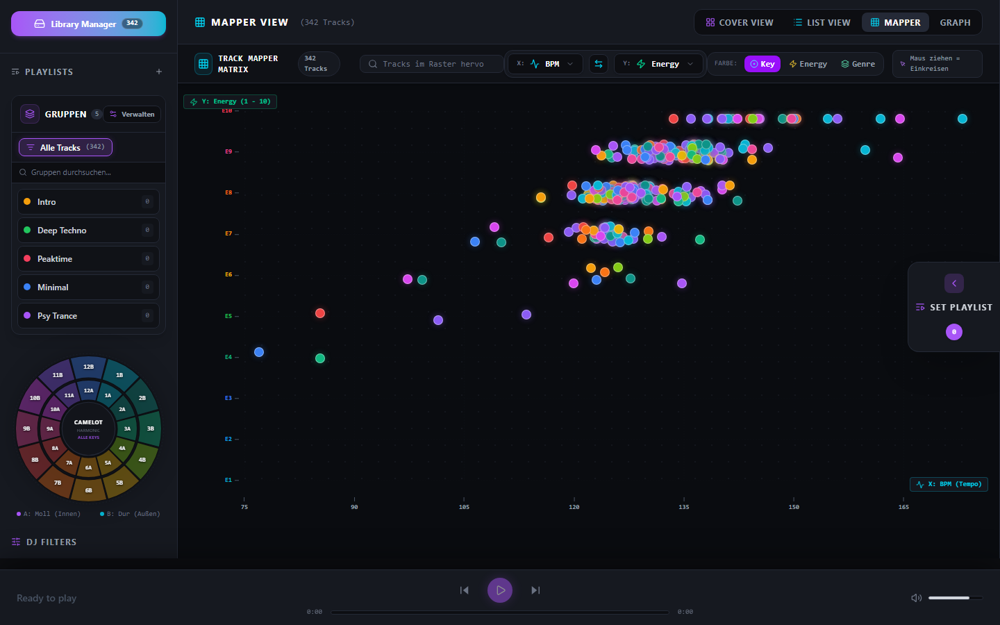
  <p><em>Track Mapper Matrix: BPM vs. Energy mit Camelot-Farben</em></p>
</div>

<div align="center">
  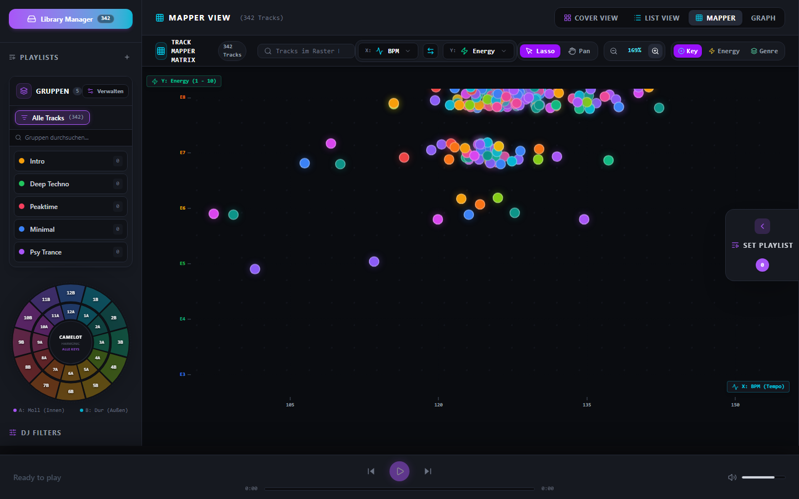
  <p><em>Stufenloser Zoom (169%): Dichte Cluster entzerren sich in gut klickbare Einzeltracks</em></p>
</div>

<div align="center">
  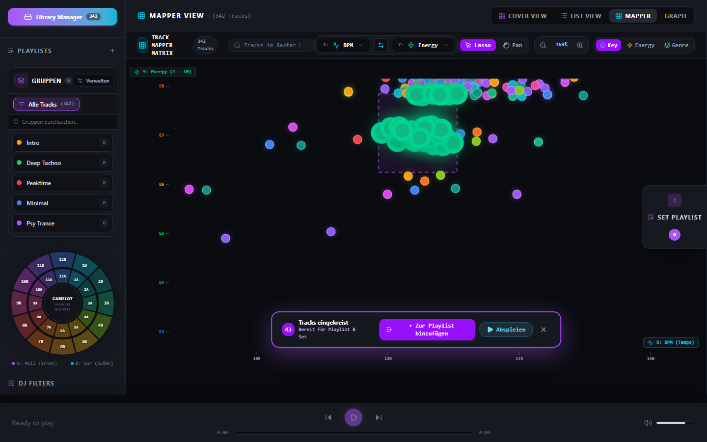
  <p><em>Maus-Lasso-Einkreisen: 43 ausgewählte Tracks mit Neon-Glow und schwebendem Playlist-Aktions-HUD</em></p>
</div>

<div align="center">
  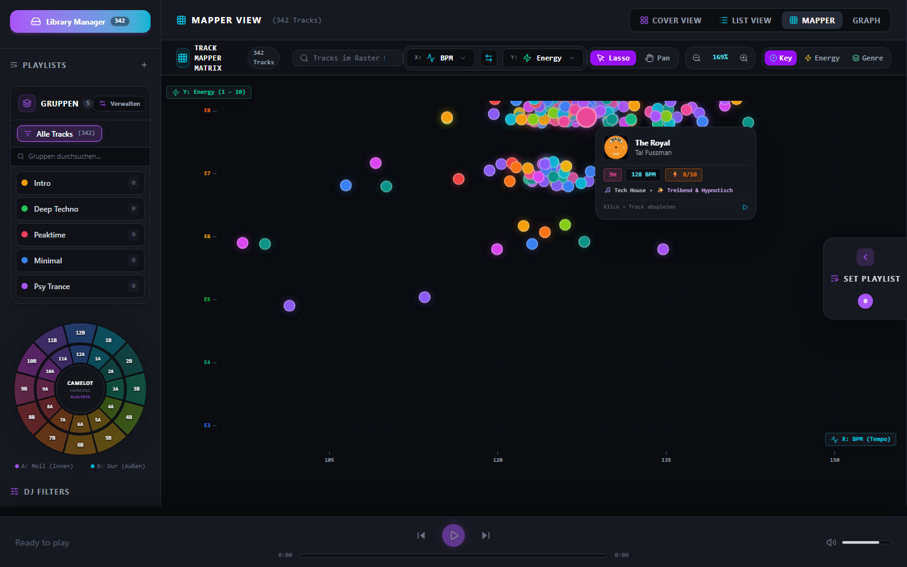
  <p><em>Akkurate Hover-Card: Dynamische Anzeige aller Track-Parameter ohne Verzerrung</em></p>
</div>

---

### 2. Musik-Bibliothek: List View & Kuration
Die Bibliotheksansichten bieten maximale Übersicht für umfangreiche Musiksammlungen:

- **Getrennte, voll sortierbare Spalten**:
  - **Interpret & Titel**: Sauber in zwei Spalten separiert mit A–Z und Z–A Sortierung per Klick auf die Kopfzeile.
  - **BPM & Energy**: Schnelle Sortierung nach Geschwindigkeit oder Intensität.
  - **Genre & Mood**: Getrennt voneinander filter- und sortierbar.
- **Camelot Wheel Harmonische Farben**:
  - Jede Tonart erstrahlt in der exakten Farbe des Camelot-Rads (z. B. 8A = Dunkelrot, 9A = Magenta, 11A = Cyan, etc.).
- **10-stufige Energy-Badges**:
  - Farbverlauf von Chilled (1/10) bis Peaktime (10/10) identisch mit den Filtern in der linken Seitenleiste.
- **Spalten-Konfigurator**:
  - Über das Zahnrad-Symbol können beliebige Spalten (Cover, Titel, Interpret, Album, BPM, Key, Energy, Genre, Mood, Dauer, Aktionen) individuell ein- oder ausgeblendet werden.
- **Intelligente Duplikate-Bereinigung**:
  - Findet Dubletten anhand von ID3-Tags, Bitraten und Audio-Signaturen und entfernt diese sicher.

<div align="center">
  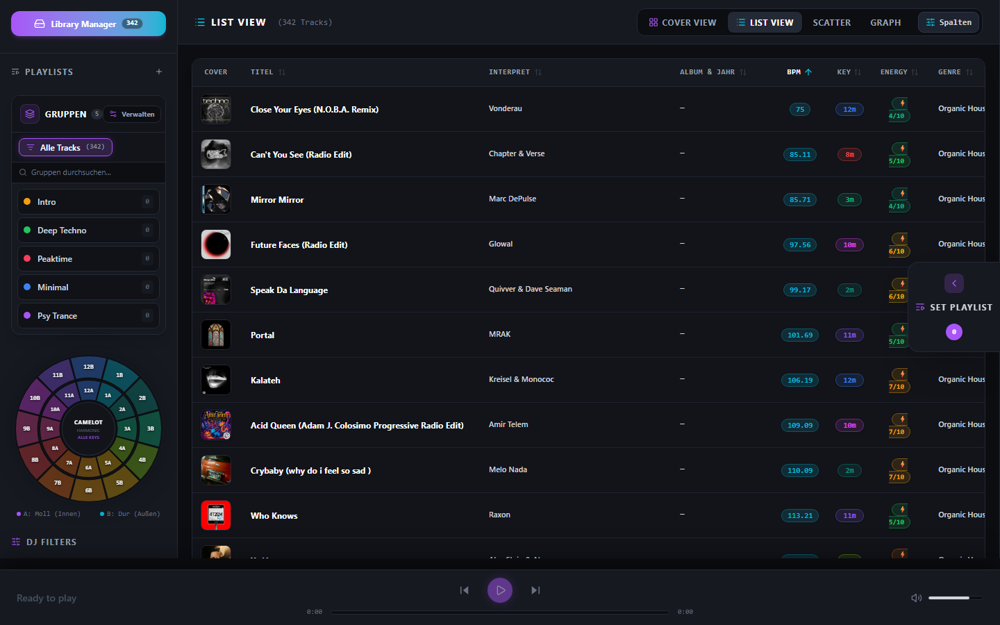
  <p><em>DJ List View: Getrennte Spalten für Interpret/Titel, BPM-Sortierung und harmonische Camelot-Farben</em></p>
</div>

<div align="center">
  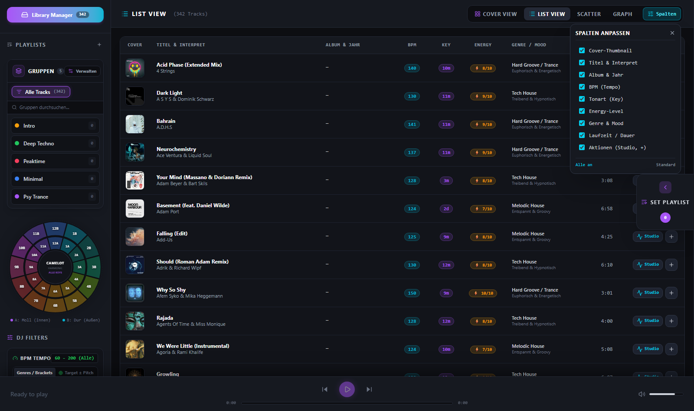
  <p><em>Spalten-Konfigurator: Benutzerdefinierte Tabellenansicht mit flexibler Sichtbarkeit</em></p>
</div>

---

### 3. Track-Analyse & Precision Deck Studio
Klicke bei einem beliebigen Track auf **"Studio"**, um in das professionelle Analyse- und Vorbereitungsdeck zu wechseln:

- **720-Slice Fluid Waveform**:
  - Dreifarbig differenzierte Frequenzbänder (Rot = Bass, Grün = Mitten, Blau = Höhen).
- **Hot-Cue Slots (1 – 5)**:
  - Definierte Einsprungpunkte: *Intro Mix In*, *Bass Entry*, *Main Drop*, *Peak Drop*, *Outro Mix Out*.
- **Dynamische Loop-Slots**:
  - Setze Live-Loops mit 1, 2, 4, 8, 16 oder 32 Beats. Gespeicherte Loops ordnen sich automatisch chronologisch in die Track-Struktur ein.
- **3-Band Spektrum Visualizer & DSP EQ-Rack**:
  - Bouncing Pegelanzeige mit 3-Band Equalizer und Kill-Switches für Bässe, Mitten und Höhen.
- **Online-Portale**:
  - Direkte 1-Klick-Recherche auf Beatport, Discogs, Traxsource und Spotify.

<div align="center">
  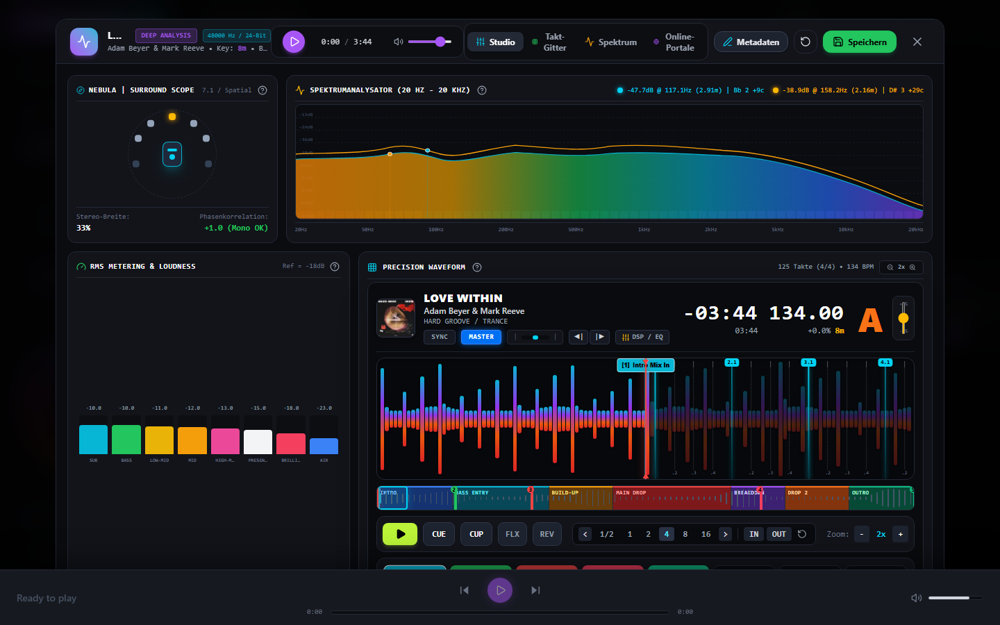
  <p><em>Precision Deck Studio: 720-Slice Wellenform, CUE-Slots, DSP EQ-Rack und Spektrum-Visualizer</em></p>
</div>

---

### 4. DJ Graph Map (Visuelles Node-Netzwerk)
Erstelle dein DJ-Set als interaktives visuelles Netzwerk:

- **2D-Netzwerk-Canvas mit Zoom & Pan**:
  - Frei verschiebbare Track-Knoten mit Ein- und Ausgangs-Ports für jeden CUE- und Loop-Slot.
- **Stabiles Verbinden (Click-to-Connect & Drag-and-Drop)**:
  - Klicke auf den Ausgangs-Port von Track A; kompatible Ziel-Ports an Track B pulsieren grün. Ein Klick auf Track B stellt die Verbindung her.
- **5 Techno-Übergangstechniken als Presets**:
  1. 🎚️ **EQ-Wechsel (Equalizer Blend)**: Gleichmäßiger Frequenztausch über 32/64 Beats.
  2. ⚡ **Bass-Swap (Instant Low-End Switch)**: Schlagartiger Tausch des Bassbereichs exakt auf dem ersten Beat ("auf die Eins").
  3. 🌊 **Filter-Sweep (HPF Transition)**: Resonanter High-Pass-Filter fährt hoch und dünnt Track A dramatisch aus.
  4. ✂️ **Cut / Drop (Fader Slam)**: Abrupter Wechsel ohne Überlappung bei Drops.
  5. 📈 **Gain Crossfade (Equal-Power)**: Konstanter Schalldruck über die gesamte Überblendung.

<div align="center">
  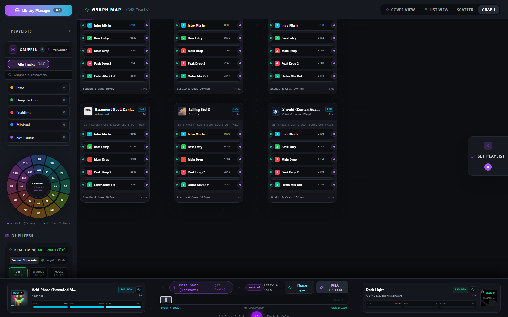
  <p><em>DJ Graph Map: Verbundenes Set-Netzwerk mit konfigurierbaren Techno-Übergangskurven</em></p>
</div>

---

### 5. Waveform Timeline Studio (Mehrspur-Zeitleiste)
Die Mehrspur-Zeitleiste erlaubt das zentimetergenaue Arrangieren von Übergängen:

- **Horizontales Verschieben mit Beatgrid-Snap**:
  - Packe eine Wellenform und bewege sie horizontal. Track B rastet automatisch im 4-Takt-Raster relativ zu Track A ein.
- **Stationärer Übergangsrahmen & `[▶ Cue Mix]`**:
  - Der Übergangsrahmen bleibt am Ausgangspunkt von Track A verankert, während Track B darunter gleitet.
  - Der `[▶ Cue Mix]`-Button springt sofort an den Startpunkt des Übergangs für ein schnelles Probehören.
- **Waveform Transition Overlap Studio**:
  - Klicke auf **"Hüllkurven"**, um die 3-Band EQ-Kurven (Bass = Orange, Mitten = Gelb, Höhen = Cyan) mit Kontrollpunkten punktgenau zu modellieren.

<div align="center">
  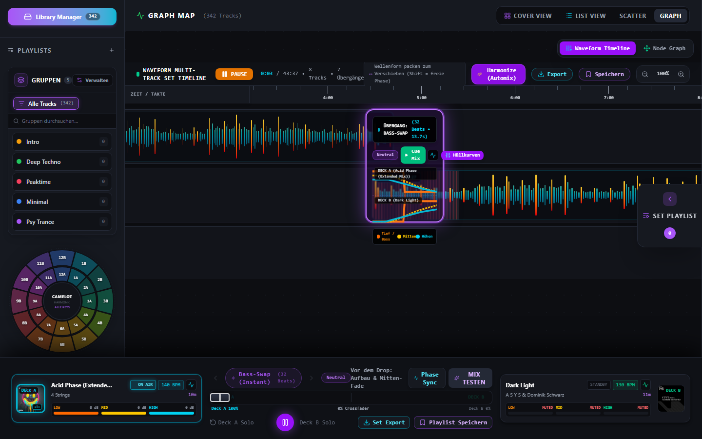
  <p><em>Waveform Timeline Studio: Übergangsrahmen mit Hüllkurven und Cue Mix Button</em></p>
</div>

<div align="center">
  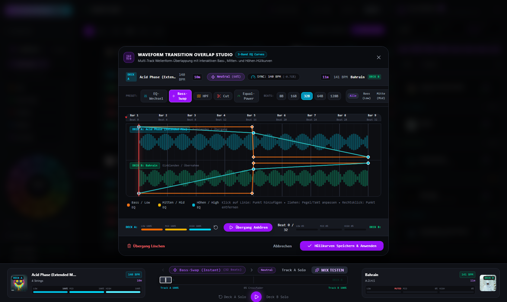
  <p><em>Transition Overlap Studio: Detail-Bearbeitung von Frequenzkurven und Lautstärken</em></p>
</div>

---

### 6. Taktgitter- & Phasen-Reparatur Studio
Behebt asynchrone Takte und unsaubere Phasen im Handumdrehen:

- **Phase Nudge**: Manuelle Phasenverschiebung um `±10 ms`, `±1/4 Beat` oder `±1 Beat`.
- **Auto Phase-Lock**: Synchronisiert die Phase von Deck B vollautomatisch mit Deck A.
- **Takt-Eins Neuausrichtung**: Setzt den Downbeat exakt an die aktuelle Nadelposition.
- **Akustisches Metronom**: Integrierter Klick-Generator zum hörbaren Takt-Abgleich.

<div align="center">
  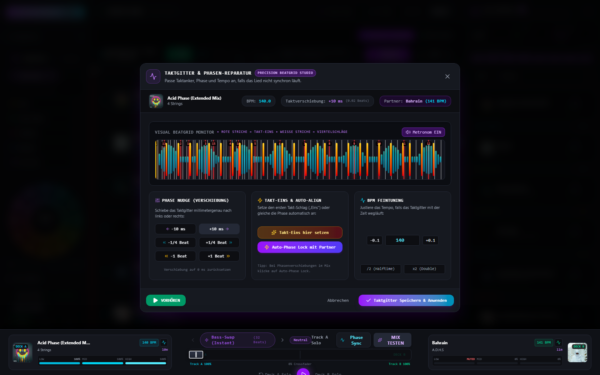
  <p><em>Taktgitter- und Phasen-Reparatur: Phasenkorrektur, Auto-Lock und akustisches Metronom</em></p>
</div>

---

### 7. Globaler DJ-Set Player & Playlist-Verwaltung
Der fest verankerte DJ-Player am unteren Bildschirmrand bietet volle Live-Kontrolle:

- **Live `● ON AIR` Status-Symbolik**:
  - Pulsierender `● ON AIR`-Badge und leuchtender Cover-Rahmen auf dem aktuell aktiven Deck.
  - Animierter Mini-Equalizer über dem Cover.
  - Inaktives Deck zeigt übersichtlich `STANDBY`.
- **Vollständig entzerrte Bedienelemente**:
  - Alle Buttons (`Play/Pause`, `Deck A Solo`, `Deck B Solo`, `Set Export`, `Playlist Speichern`) und Fader sind mit 16 px Bodenfreiheit vollständig sichtbar und unbeschnitten.
  - Der Crossfader und die Hoch-, Mitten- und Tiefen-Fader bewegen sich synchron zur Wiedergabeposition und den Übergangskurven.
- **Persistente Playlisten & M3U-Export**:
  - Speichere arrangierte Sets in der Playlisten-Verwaltung und exportiere sie als M3U-Dateien für Rekordbox, Traktor oder USB-Sticks für Pioneer CDJs.

<div align="center">
  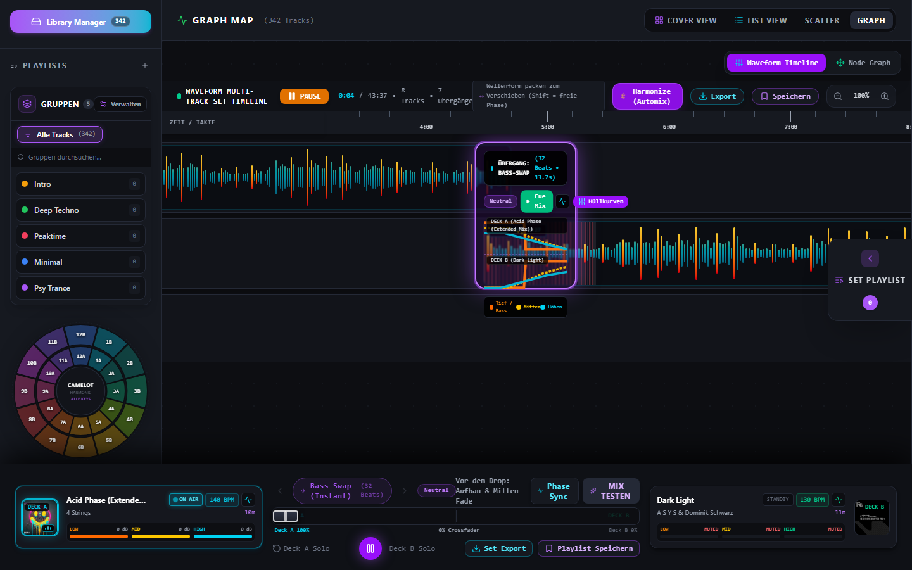
  <p><em>Globaler DJ-Set Player: Live ON AIR Status, synchrone 3-Band EQ Fader, Crossfader und unbeschnittene Buttons</em></p>
</div>

<div align="center">
  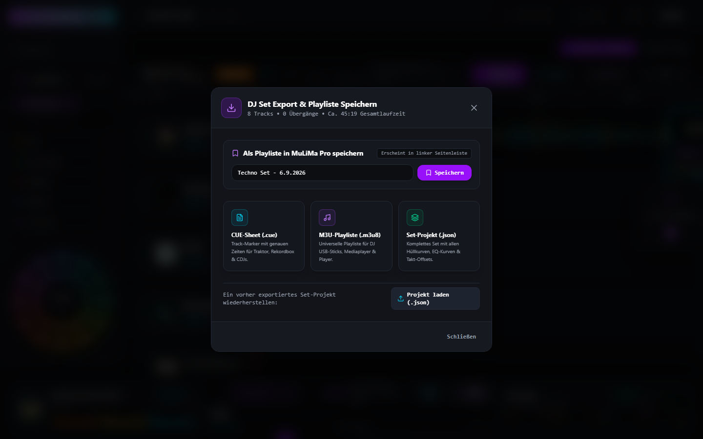
  <p><em>DJ Set Export: Export von Playlisten und Metadaten als universelle M3U-Datei</em></p>
</div>

<div align="center">
  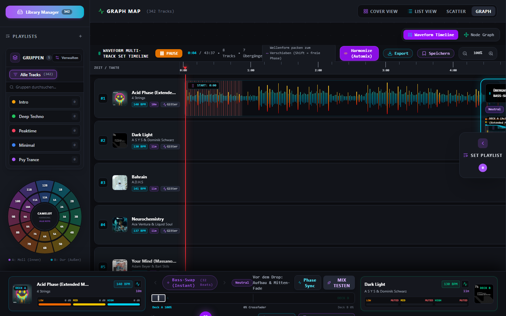
  <p><em>Playlist-Verwaltung: Dauerhafte Speicherung und Verwaltung beliebig vieler Sets</em></p>
</div>

---

## 🛠️ Technologie-Stack
- **Frontend**: React 19, TypeScript, Tailwind CSS
- **Bundler & Server**: Vite 6, Connect / Express Middleware
- **Audio-Engine**: Web Audio API (BiquadFilterNode, GainNode, AudioBufferSourceNode, AnalyserNode)
- **Metadaten & ID3**: `jsmediatags`
- **Lokale Datenbank**: IndexedDB via `idb`
- **Testing & E2E**: Playwright Test Suite

---

## 📄 Lizenz
MIT License — Frei verwendbar für private und professionelle DJ-Sets.

