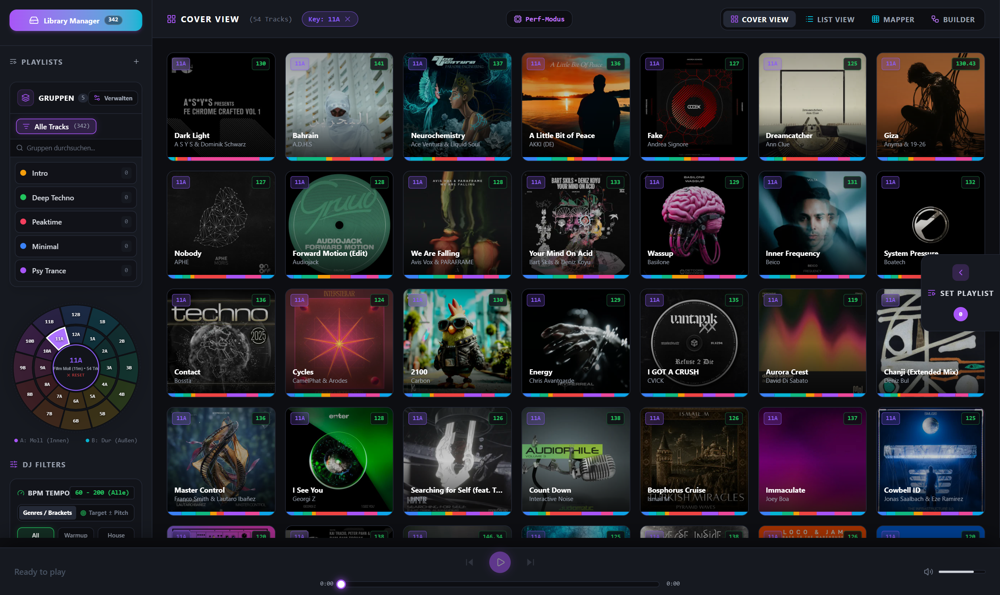
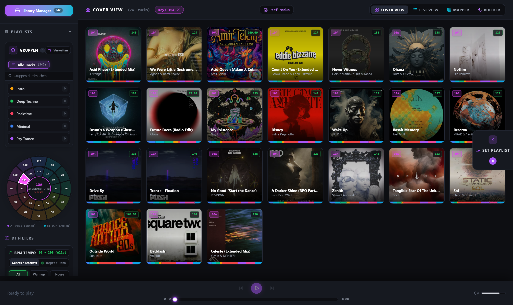
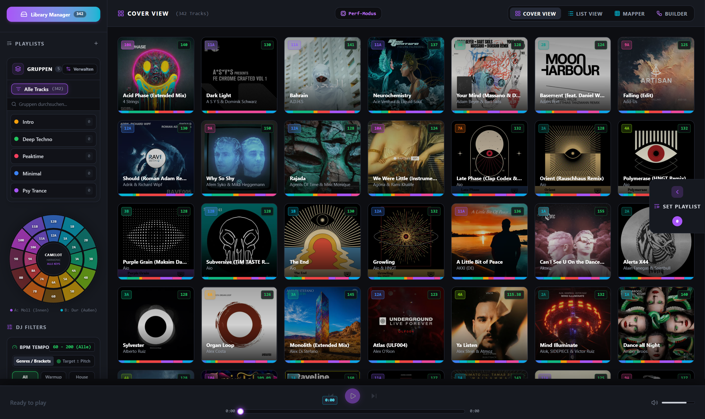

# MuLiMa Pro — Music Library Manager Pro & DJ Set Studio

<div align="center">
  <h3>Professionelle Musik-Bibliothek, Harmonic Mixing, 2D Track-Mapper & DJ Set Studio</h3>
  <p>Entwickelt für DJs, Producer und Musik-Kuratoren zur nahtlosen Vorbereitung und Bearbeitung von DJ-Sets mit echten Mixing-Techniken.</p>
</div>

---

## 📖 Über MuLiMa Pro

**MuLiMa Pro** (Music Library Manager Pro) vereint die Bibliotheks- und Metadaten-Verwaltung professioneller DJ-Software (wie Rekordbox, Traktor oder Serato) mit der visuellen Mehrspur-Bearbeitung moderner DJ-Arrangement-Tools. 

Die App analysiert deine Musiksammlung automatisch nach **BPM**, **Camelot-Tonarten** und **Struktur-Phrasen (Mixed In Key 11 Standard)**, platziert Tracks in einem **interaktiven 2D-Raster**, ermöglicht das Bauen von Sets in einem **visuellen Node-Netzwerk (Builder View)** oder auf einer **Mehrspur-Wellenform-Zeitleiste** und exportiert fertige Sets als **MP3-Mix**, **M3U-Playliste** oder **strukturierte Text-Trackliste**.

---

## 🚀 Schnellstart-Anleitung (Auch für absolute Beginner)

Du kannst MuLiMa Pro direkt auf deinem eigenen PC oder Laptop nutzen. Es sind keine Programmierkenntnisse erforderlich!

### 1. Einmalige Voraussetzung
Um die App auf deinem Rechner auszuführen, benötigst du das kostenlose Programm **Node.js**:
- Lade **Node.js** von der offiziellen Website herunter: 👉 **[https://nodejs.org/](https://nodejs.org/)** (wähle die empfohlene *LTS-Version*).
- Führe das Installationsprogramm aus und klicke einfach auf *Weiter / Installieren*.

---

### 2. App herunterladen

- Klicke oben rechts auf dieser GitHub-Seite auf den grünen Button **`Code`** und wähle **`Download ZIP`**.
- Entpacke die heruntergeladene ZIP-Datei an einem beliebigen Ort auf deiner Festplatte (z. B. auf dem Desktop oder unter Dokumente).
- *(Alternativ für Git-Nutzer: `git clone https://github.com/h4real82/music-library-manager-pro.git`)*

---

### 3. App mit 1 Klick starten

#### 🪟 Unter Windows (1-Klick-Start):
1. Öffne den entpackten Ordner `music-library-manager-pro`.
2. Mache einen **Doppelklick auf `start.bat`**.
3. **Das war's schon!** Das Skript richtet beim ersten Start automatisch alles ein, startet den Server und öffnet die App direkt in deinem Standard-Webbrowser unter **`http://localhost:3000`**.

#### 🍎 Unter macOS & 🐧 Linux:
1. Öffne das Terminal im Programmordner.
2. Führe das Start-Skript aus:
   ```bash
   chmod +x start.sh
   ./start.sh
   ```
3. Die App öffnet sich automatisch in deinem Browser unter **`http://localhost:3000`**.

#### 💻 Manuelle Methode über das Terminal (für Fortgeschrittene):
Falls du die Befehle lieber manuell eingeben möchtest:
```bash
# 1. In den Ordner wechseln
cd music-library-manager-pro

# 2. Abhängigkeiten installieren
npm install
# (oder falls installiert: bun install)

# 3. Server starten
npm run dev
# (oder: bun run dev)
```
Öffne anschließend deinen Browser und gehe auf: **[http://localhost:3000](http://localhost:3000)**

---

### 4. Musikdateien hinzufügen

Es gibt zwei kinderleichte Wege, um deine Musik in die App zu laden:

1. **Über den Musikordner `LIBRARY/` (Empfohlen für große Sammlungen)**:
   - Kopiere deine Audio-Dateien (MP3, WAV, FLAC, AAC, OGG) direkt in den im Hauptverzeichnis liegenden Ordner **`LIBRARY/`** (auch Unterordner werden automatisch durchsucht).
   - Die App erkennt die Dateien beim nächsten Start sofort und liest Cover, Titel, Künstler und Tonarten ein.
2. **Direkt per Drag & Drop im Browser**:
   - Ziehe Audio-Dateien oder ganze Ordner einfach mit der Maus in das Browserfenster von MuLiMa Pro.
   - Alternativ kannst du in der App oben links auf **"Library Manager"** klicken und Dateien oder Ordner auswählen.

---

## 🎛️ Die Besonderheiten & Funktionen im Überblick

---

### 1. Track Mapper Matrix (2D-Harmonie- & BPM-Raster)

Die **Track Mapper Matrix** visualisiert deine gesamte Musiksammlung auf einem interaktiven 2D-Koordinatenfeld. So siehst du auf einen Blick, welche Tracks harmonisch und vom Tempo her perfekt zueinander passen:

- **Standardansicht X = BPM, Y = Camelot Key**: Die horizontale Achse zeigt die Geschwindigkeit (BPM), die vertikale Achse die Tonart (1A bis 12B). Beide Achsen lassen sich flexibel auf *Energy*, *Genre* oder *Mood* umschalten oder per Knopfdruck (`⇄`) tauschen.
- **Anti-Kollisions-Layout (Kein Überlappen)**: Ein physikalischer Relaxations-Algorithmus fächert Tracks mit identischem BPM und Key automatisch in einer harmonischen Rosette auf. Keine Punkte verdecken sich gegenseitig!
- **Miniatur-Cover-Thumbnails**: Jeder Track wird als kleines Album-Cover mit farbigem Camelot-Rahmen und Key-Badge dargestellt.
- **Stufenloser Zoom & Pan (0.8x bis 5.0x)**: Zoome mit dem Mausrad stufenlos in dichte Cluster hinein und bewege das Raster per Rechtsklick-Ziehen oder Leertaste.
- **Maus-Lasso**: Zeichne mit der Maus eine beliebige Schleife um Tracks, um sie gemeinsam auszuwählen und per Klick direkt in dein DJ-Set zu übernehmen.

<div align="center">
  
  <p><em>Track Mapper Matrix: 2D-Rasteransicht mit harmonischer Farbcodierung und Live-Zoom</em></p>
</div>

<div align="center">
  
  <p><em>Maus-Lasso: Tracks einfach mit der Maus einkreisen und gesammelt ins Set laden</em></p>
</div>

<div align="center">
  
  <p><em>Hover-Card: Detailanzeige aller Parameter (BPM, Key, Energy, Genre) beim Überfahren mit der Maus</em></p>
</div>

---

### 2. Builder View (Interaktives DJ-Node-Netzwerk)

In der **Builder View** baust du dein DJ-Set als visuelles Netzwerk aus miteinander verknüpften Track-Knoten auf:

- **Knoten & Audio-Ports**: Jeder Track besitzt Ein- und Ausgangs-Ports für seine CUE-Punkte und Loop-Sektionen.
- **Click-to-Connect**: Klicke auf den Ausgangs-Port von Track A und verbinde ihn mit dem Startpunkt von Track B.
- **5 echte Techno-Übergangstechniken**:
  1. 🎚️ **EQ-Wechsel (Equalizer Blend)**: Gleichmäßiger Frequenztausch über 32 oder 64 Beats.
  2. ⚡ **Bass-Swap (Instant Low-End Switch)**: Schlagartiger Tausch des Basses exakt auf dem ersten Beat ("auf die Eins").
  3. 🌊 **Filter-Sweep (HPF Transition)**: Resonanter Hochpassfilter dünnt Track A dramatisch aus.
  4. ✂️ **Cut / Drop (Fader Slam)**: Abrupter Wechsel ohne Überlappung bei Drops.
  5. 📈 **Gain Crossfade (Equal-Power)**: Konstanter Schalldruck über die gesamte Überblendung.

<div align="center">
  
  <p><em>Builder View: Visuelle Verknüpfung von Tracks mit konfigurierbaren Übergangskurven</em></p>
</div>

---

### 3. Waveform Timeline Studio (Mehrspur-Zeitleiste)

Das Mehrspur-Studio ermöglicht das zentimetergenaue Arrangieren deiner Übergänge auf einer echten Zeitleiste:

- **Master-Playhead**: Ein vertikaler Playhead gleitet flüssig über das Zeitlineal und steuert synchron die beiden DJ-Decks.
- **Verschieben mit Takt-Einrasten (Beatgrid-Snap)**: Verschiebe Trackspuren horizontal – sie rasten automatisch im 4-Takt-Raster zueinander ein, sodass die Kicks exakt synchron laufen.
- **Verschiebbares Übergangsfenster & `[▶ Cue Mix]`**: Das Übergangsfenster zeigt genau die Stelle, an der der Wechsel stattfindet. Mit dem *Cue Mix*-Button kannst du den Übergang sofort probehören.
- **Transition Overlap Studio mit 3-Band EQ-Hüllkurven**: Modelliere Bass- (Orange), Mitten- (Gelb) und Höhen-Kurven (Cyan) mit flexiblen Kontrollpunkten.

<div align="center">
  
  <p><em>Waveform Timeline: Mehrspur-Zeitleiste mit synchronem Master-Playhead und aktiven DJ-Decks</em></p>
</div>

<div align="center">
  
  <p><em>Transition Overlap Studio: Präzise Bearbeitung von 3-Band EQ-Hüllkurven und Lautstärken</em></p>
</div>

---

### 4. Musik-Bibliothek: Cover View & List View

Verwalte und kuratiere selbst riesige Musikbibliotheken blitzschnell:

- **Cover View & List View**: Wähle zwischen großen Cover-Kacheln oder einer kompakten, voll sortierbaren Tabellenansicht.
- **Getrennte Spalten**: Interpret, Titel, BPM, Key, Energy, Genre, Mood und Trackdauer lassen sich separat per Klick auf die Kopfzeile sortieren.
- **Spalten-Konfigurator**: Blende über den *Spalten*-Button beliebige Spalten ein oder aus.
- **Fokussierte Arbeitsfläche**: Die linke Seitenleiste mit Playlisten, Gruppen und Filtern wird in der *Builder View* und im *Mapper* automatisch ausgeblendet, damit du die volle Bildschirmbreite nutzen kannst.

<div align="center">
  
  <p><em>List View: Sortierbare Spalten für Interpret/Titel, BPM-Sortierung und Camelot-Farben</em></p>
</div>

<div align="center">
  
  <p><em>Spalten-Konfigurator: Individuelle Anpassung der Tabellenspalten</em></p>
</div>

---

### 5. Interaktives Camelot Wheel (Harmonisches Mixing)

Finde sekundenschnell Tracks, die musikalisch perfekt harmonieren:

- **1-Klick-Filter**: Klicke auf ein Kreissegment des Camelot Wheel, um die gesamte Bibliothek auf diese Tonart zu filtern.
- **Multi-Notations-Erkennung**: Erkennt automatisch Formate aus Rekordbox (`11m` ➔ `11A`, `7d` ➔ `7B`), musikalische Tonarten (`Am`, `F#m`) sowie Traktor/OpenKey und wandelt sie in den standardisierten Camelot-Code um.
- **Harmonische Farbkennzeichnung**: Jede Tonart erstrahlt in der unverwechselbaren Farbe des Camelot-Kreises.

<div align="center">
  
  <p><em>Camelot Wheel: 1-Klick-Filterung nach 11A mit Rekordbox-Normalisierung (11m)</em></p>
</div>

<div align="center">
  
  <p><em>Camelot Wheel: Tonart 10A mit Farb- und Notations-Synchronität</em></p>
</div>

---

### 6. Track-Analyse Studio & Precision Waveform (Mixed In Key 11)

Klicke bei einem Track auf **"Studio"**, um in das detaillierte Analyse- und Vorbereitungsdeck zu wechseln:

- **720-Slice Dreifarben-Wellenform**: Frequenzgetrennte Darstellung (Rot = Bass/Sub, Grün = Mitten/Vocals, Blau = Höhen/Hi-Hats).
- **8 automatische CUE-Punkte nach Mixed In Key Vorbild**: Erkennt Phrasenwechsel und Strukturteile (*Intro, Bassline, Verse, Build-Up, Drop, Breakdown, Outro*).
- **Präzisions-Taktgitter (Beatgrid Anchor)**: Taktstriche sitzen mathematisch exakt auf den Kick-Transienten und lassen sich per Doppelklick und Nudge feinjustieren.
- **Dynamic Loops & 3-Band EQ**: Setze Live-Loops mit 1 bis 32 Beats und nutze den integrierten Equalizer mit Kill-Switches.

<div align="center">
  
  <p><em>Precision Waveform: Taktstriche sitzen zentimetergenau im Zentrum der Kick-Ausschläge</em></p>
</div>

<div align="center">
  
  <p><em>Studio Analyse: 8 automatische CUE Points mit lückenloser Erkennung musikalischer Formteile</em></p>
</div>

---

### 7. Vorhörfunktion & Interaktiver Scrubber

Am unteren Bildschirmrand steht dir eine permanente Vorhörleiste zur Verfügung:

- **Maus-verschiebbarer Playhead**: Ziehe den Positionspunkt flüssig mit der Maus über die Wellenform (`Real-time Drag Scrubbing`).
- **Live Zeit-Tooltip**: Zeigt beim Überfahren die exakte Zielzeit an.
- **Klickbare Makro-Sektionen**: Klicke auf ein Segment (*Intro, Drop, Outro*), um sofort an dessen Taktanfang zu springen.

<div align="center">
  
  <p><em>Vorhörleiste: Flüssiges Scrubbing, Hover-Zeitstempel und direkte Sektions-Sprünge</em></p>
</div>

---

### 8. Taktgitter- & Phasen-Reparatur Studio

Behebt unsaubere Phasen und Takt-Verschiebungen:

- **Phase Nudge**: Verschiebe die Phase manuell in feinen Schritten (`±10 ms`, `±1/4 Beat` oder `±1 Beat`).
- **Auto Phase-Lock**: Gleicht die Phase von Deck B vollautomatisch mit Deck A ab.
- **Akustisches Metronom**: Integrierter Klick-Generator zum hörbaren Abgleich des Taktes.

<div align="center">
  
  <p><em>Taktgitter-Reparatur: Phasenkorrektur, Auto Phase-Lock und akustisches Metronom</em></p>
</div>

---

### 9. Globaler DJ-Set Player & 3-Wege-Export

Der feste DJ-Player am unteren Bildschirmrand bietet ständige Kontrolle über dein Set:

- **Live `● ON AIR` Status**: Leuchtender Deck-Rahmen und Equalizer-Animation zeigen sofort, welcher Track gerade live im Master zu hören ist.
- **Fader & Crossfader**: Bewegen sich synchron zur Wiedergabe und den programmierten Übergangskurven.
- **3 fokussierte Export-Optionen**:
  1. 🎚️ **Audio Mix (.mp3)**: Rendert das vollständige DJ-Set inklusive aller Überblendungen als fertige MP3-Master-Audiodatei.
  2. 🎵 **M3U-Playliste (.m3u8)**: Universelle Playliste für DJ-USB-Sticks, Pioneer CDJs, Mediaplayer und Streaming.
  3. 📄 **Trackliste (.txt)**: Formatierte Textdatei mit Start-Timestamps `[MM:SS]`, Künstler, Titel, BPM, Tonarten und Dauer.

<div align="center">
  
  <p><em>DJ-Set Player: Live ON AIR Status, synchrone 3-Band EQ Fader und Crossfader</em></p>
</div>

<div align="center">
  
  <p><em>Set Export Modal: Export als fertiger MP3-Audiomix, M3U-Playliste oder strukturierte Text-Trackliste</em></p>
</div>

---

## 🛠️ Technologie-Stack

- **Frontend**: React 19, TypeScript, Tailwind CSS
- **Bundler & Server**: Vite 6, Node.js Express / Connect Middleware
- **Audio-Engine**: Web Audio API (OfflineAudioContext, BiquadFilterNode, GainNode, AnalyserNode)
- **Metadaten-Extraktion**: `jsmediatags`
- **Lokale Datenbank**: IndexedDB (Browser-intern über `idb`)
- **Testing**: Vitest & Playwright Test Suite

---

## 📄 Lizenz

Dieses Projekt steht unter der **MIT-Lizenz** — frei verwendbar für private und professionelle DJ-Sets.
